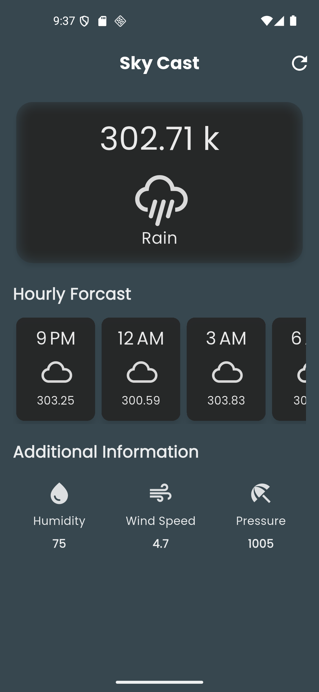
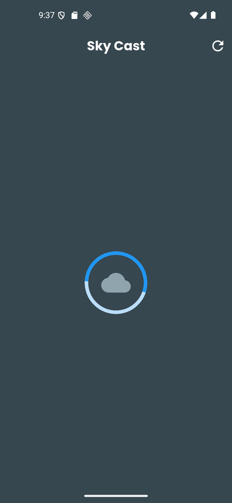

# 🌦️ Flutter Weather Forecast App

A beautiful and responsive Flutter application that displays weather forecast data using OpenWeatherMap API. This app includes custom UI widgets and animations for an engaging user experience.

---

## 📱 App Preview
<h2>📱 App Preview</h2>

<p align="center">
  
  
  
</p>


---

## 🚀 Features

- 5-day weather forecast with 3-hour intervals
- Beautiful UI with custom cards and progress indicators
- JSON data parsing using OpenWeatherMap API
- Dynamic temperature, humidity, wind, and cloud data
- Modular Flutter widget structure

---

## 📂 Project Structure

```text
lib/
├── main.dart                          # App entry point
├── weather_app.dart                   # Core layout and integration
├── card_forecast_item.dart           # Forecast card UI
├── additional_item.dart              # Extra weather info card
├── custom_circular_progress_indicator.dart  # Custom animated loading indicator
├── key.dart                          # API key management
assets/
└── preview.png                        # Reference image of the app (add this!)
